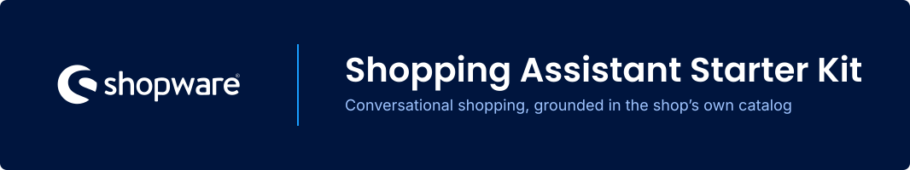

[](https://github.com/agentic-commerce-lab/shopping-assistant-starter-kit/actions/workflows/quality-gate-strict.yml)
[](https://github.com/agentic-commerce-lab/shopping-assistant-starter-kit/actions/workflows/release.yml)
[](LICENSE)

A shopper-facing conversational assistant for Shopware 6.6 and 6.7, grounded in the merchant's own
catalogue and operated entirely inside the shop.

Ask *"Do you have the trail jersey in blue, size M?"* and the assistant can find the correct
variant, show its current price and stock, and link to the real product. Ask it to add the item to
the cart and it uses the shopper's existing Shopware cart. Checkout remains Shopware's normal
checkout.

> [!IMPORTANT]
> **Research preview / lab prototype.** This is not production software. It comes without support,
> upgrade guarantees, or a Shopware Store release.

## Choose your path

| I want to… | Start here |
|---|---|
| Install and configure the assistant | [Read the manual](docs/manual.md) |
| Extend it with tools, data sources, or integrations | [Read the extension guide](docs/extending.md) |
| Understand its boundaries and design decisions | [Explore the architecture](ARCHITECTURE.md) |
| Understand why the project exists | [Read the vision](VISION.md) |

## Why this is more than a chatbot shell

The model never writes the product facts a shopper sees. It selects product IDs; the plugin then
renders prices, stock, URLs, and images from Shopware's live `SalesChannelContext`. Customer-group
pricing, rules, and the current session therefore stay authoritative.

This creates three structural guarantees:

- **Grounded product facts:** the model cannot invent a displayed price or stock level.
- **Variant-level answers:** size, colour, price, and availability come from the selected variant,
  not from an aggregate parent product.
- **A real catalogue boundary:** blocked products never enter the model context.

## What ships

- **Conversational product discovery:** search, inspect, compare, and add products to the cart.
- **Six built-in tools:** `search_products`, `get_product`, `add_to_cart`, `compare_products`,
  `search_shop_info`, and `escalate`. Disabled tools are removed from the model's toolbox.
- **Shop knowledge:** answer from legal pages, shipping information, and uploaded documents through
  optional vector search.
- **Merchant controls:** catalogue scope, cart limits, request limits, escalation, voice, and widget
  appearance.
- **Guard rails:** per-caller throttling, an optional daily spend ceiling, a maximum cart value, and
  SSRF protection for the model endpoint.
- **Observability:** inspect each turn, retrieval step, refusal, and rendered result in the
  Administration; export traces as JSON.
- **A compiled storefront widget:** no Node toolchain is needed in the shop. The entry point loads
  1.5 KB gzipped; larger chunks arrive only after the shopper opens the panel.
- **A live eval suite:** 36 journeys exercise grounding, safety, cart behaviour, retrieval, and
  escalation against a real model endpoint.

The assistant deliberately does **not** complete checkout or take payment, change or negotiate
prices, access account or order data, or pretend that a human was notified. Unsupported requests are
declined or sent to a merchant-configured contact route.

## Get started

You need:

- Shopware **6.6.10.23 or newer**, or any 6.7, and PHP 8.2 or newer. Older 6.6 patches ship
  Symfony 7.2, and the Symfony AI packages this plugin is built on need 7.3 — so the
  `symfony/*` constraints refuse those installs rather than failing later;
- an OpenAI-compatible chat-completions endpoint;
- Composer access to the shop for the plugin's PHP dependencies.

### 1. Protect the shop from Symfony Flex recipes

Create these files **before** installing the AI packages. Otherwise Symfony Flex writes unsupported
`ai:` configuration and the entire storefront can return HTTP 500.

```fish
mkdir -p config/packages
for f in ai_generic_platform ai_maria_db_store
    printf '# Intentionally empty — see SwagAssistantStarterKit manual.\n' > config/packages/$f.yaml
end
```

The [installation guide](docs/manual.md#installing-it-into-a-shop) explains why both placeholders are
needed and covers source and release-zip installations.

### 2. Install the plugin

Choose one route:

- **For development:** install the repository through a Composer path repository.
- **For evaluation:** download
  **[SwagAssistantStarterKit.zip](https://github.com/agentic-commerce-lab/shopping-assistant-starter-kit/releases/latest/download/SwagAssistantStarterKit.zip)**
  and follow the [release-zip instructions](docs/manual.md#from-the-release-zip-instead).

The release archive contains the compiled plugin, but not its PHP dependencies. Those dependencies
must be installed in the shop's own vendor directory.

### 3. Connect a model

Set the base URL, model ID, and API key in the plugin settings under **Language model**. For a local
evaluation, you can also configure them from the shop root:

```fish
bin/console system:config:set SwagAssistantStarterKit.config.llmBaseUrl "https://openrouter.ai/api"
bin/console system:config:set SwagAssistantStarterKit.config.llmModel "provider/model-id"
bin/console system:config:set SwagAssistantStarterKit.config.llmApiKey "sk-…"
```

For production, prefer `ASSISTANT_LLM_BASE_URL`, `ASSISTANT_LLM_MODEL`, and
`ASSISTANT_LLM_API_KEY`: environment values take precedence, while Shopware system configuration is
not secret storage. The base URL must not include `/v1`; the platform appends
`/v1/chat/completions` itself.

Continue with [model configuration](docs/manual.md#configuring-a-model), then compile the theme:

```fish
bin/console theme:compile
```

## How it fits into Shopware

Everything runs as one Shopware plugin. There is no external app server and no service operated by
this project.

```text
Storefront widget
  └── POST /assistant/chat
        └── request and spend limits
        └── Symfony AI agent and bounded tool loop
              └── Shopware DAL and SalesChannel services
        └── server-side fact rendering and trace persistence

Shopware Administration
  └── configuration, shop-information indexing, and conversation traces
```

The runtime uses [`symfony/ai-agent`](https://github.com/symfony/ai). The project owns the commerce
gateway, grounding pipeline, policy controls, and rendering. Only project DTOs cross the commerce
boundary, which also lets the deterministic test suite run without Shopware or a database.

For the complete pipeline and its design decisions, see [ARCHITECTURE.md](ARCHITECTURE.md) and
[ADR 0001](docs/adr/0001-symfony-ai-as-agent-runtime.md).

## Extend it without forking the core

Tools, prompts, model providers, trace sinks, document extractors, vector storage, catalogue access,
and widget markup all have documented extension seams. Most use ordinary Symfony service tags or
decoration.

Start with [docs/extending.md](docs/extending.md). It explains the two tool tiers, the grounding
obligations that catalogue-aware tools must follow, and the interfaces a custom commerce gateway
needs to implement to avoid silent degradation.

Product ranking rules, new knowledge-source integrations, context compression, and MCP surfaces are
not extension seams yet.

## Documentation

| Document | Use it for |
|---|---|
| [Manual](docs/manual.md) | Requirements, installation, configuration, operations, widget, and probe commands |
| [Extension guide](docs/extending.md) | Tools, providers, data integrations, catalogue backends, widget events, and eval assertions |
| [Architecture](ARCHITECTURE.md) | Components, contracts, data flow, grounding, and decisions |
| [Vision](VISION.md) | Purpose, audiences, success criteria, and non-goals |
| [Glossary](GLOSSARY.md) | Project-specific terms and distinctions |
| [ADRs](docs/adr/) | Decisions of record |

## Development

```fish
composer install
composer run test               # deterministic; never calls a model
composer run quality            # format, lint, types, architecture, and security
composer run build:storefront   # rebuild committed storefront assets
```

Do not run bare `phpunit`: only the Composer script excludes the eval group, which calls a real
model and spends money. See [Running the eval suite](docs/manual.md#running-the-eval-suite) when you
intend to run those journeys.

To release a new version, update `Version::CURRENT` in [src/Version.php](src/Version.php) and the
matching expectation in `tests/SmokeTest.php`, then push a matching `v*` tag. The release workflow
rejects a tag that disagrees with the code.

---

[MIT](LICENSE). Built by the Agentic Commerce Lab.
