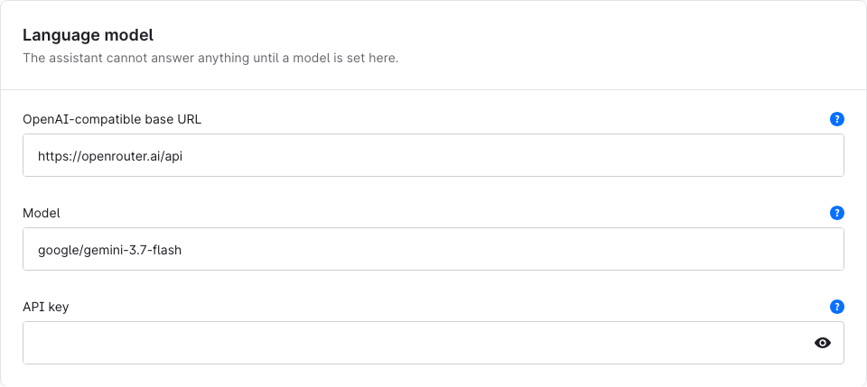
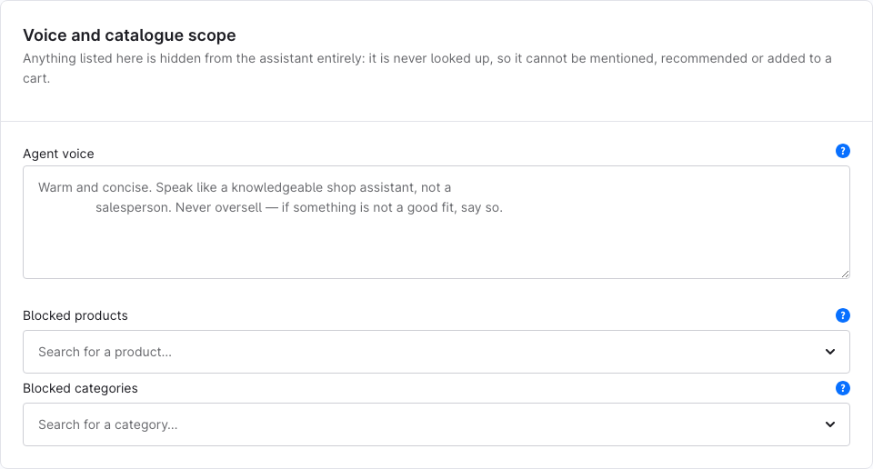

[](https://github.com/agentic-commerce-lab/shopping-assistant-starter-kit/actions/workflows/quality-gate-strict.yml)
[](https://github.com/agentic-commerce-lab/shopping-assistant-starter-kit/actions/workflows/release.yml)
[](LICENSE)

A customizable starter kit for merchants, agencies, and developers building a shopper-facing
assistant for Shopware 6.7. It provides a working reference implementation that you can evaluate in
a real shop, adapt to a merchant's catalogue, and use as the foundation for a custom assistant.

This is **not a finished assistant or a production-ready Shopware Store extension**. It is a
starting point: connect your model, decide what the assistant may see and do, tailor the storefront
experience, and test the result against your own catalogue.

> [!IMPORTANT]
> **Research preview / lab prototype.** This is not production software. It comes without support,
> upgrade guarantees, or a Shopware Store release.

[Download](#download) · [What ships](#what-ships) · [Watch the demo](#see-it-in-action) ·
[Quick start](#quick-start) · [Configure](#configure-it-for-your-shop) ·
[Extend](#extend-it-without-forking-the-core)

## Download

**[Download the latest SwagAssistantStarterKit.zip](https://github.com/agentic-commerce-lab/shopping-assistant-starter-kit/releases/latest/download/SwagAssistantStarterKit.zip)**
· [View all releases](https://github.com/agentic-commerce-lab/shopping-assistant-starter-kit/releases)

The archive contains the compiled plugin, but not its PHP dependencies. Follow the
[release installation guide](docs/manual.md#from-the-release-zip-instead) to install those
dependencies in the shop's vendor directory. Developing the plugin instead? Use the
[Composer path-repository setup](docs/manual.md#from-a-composer-path-repository).

## What ships

- **A working reference assistant:** shoppers can search and inspect products, select variants, add
  eligible items to their existing cart, and continue through Shopware's normal checkout.
- **Seven built-in tools:** `search_products`, `get_product`, `add_to_cart`, `go_to_checkout`,
  `compare_products`, `search_shop_info`, and `escalate`. Disabled tools are removed from the
  model's toolbox.
- **Grounded product cards:** prices, stock, URLs, images, options, and availability are rendered
  from Shopware's live `SalesChannelContext`, not copied from model prose.
- **Optional shop knowledge:** answer from legal pages, shipping information, and uploaded
  documents through vector search.
- **Merchant controls:** configure catalogue scope, cart and request limits, escalation, voice,
  greeting, suggestions, and widget appearance in the Administration.
- **Built-in guard rails:** per-caller throttling, an optional daily spend ceiling, a maximum cart
  value, bounded tool loops, and SSRF protection for the model endpoint.
- **Observability:** inspect conversations, retrieval steps, refusals, and rendered results in the
  Administration, or export traces as JSON.
- **A compiled storefront widget:** no Node toolchain is needed in the shop. The 1.5 KB gzipped
  entry point loads first; larger chunks arrive only when the shopper opens the panel.
- **A live eval suite:** 36 journeys exercise grounding, safety, cart behaviour, retrieval, and
  escalation against a real model endpoint.

The starter kit deliberately does **not** complete checkout or take payment, change or negotiate
prices, access account or order data, or pretend that a human was notified. Unsupported requests
are declined or, when configured, answered with a merchant-provided contact link.

## See it in action

[](https://github.com/agentic-commerce-lab/shopping-assistant-starter-kit/blob/main/docs/assets/shopping-assistant-demo.mp4)

**[Watch the full 73-second demo →](https://github.com/agentic-commerce-lab/shopping-assistant-starter-kit/blob/main/docs/assets/shopping-assistant-demo.mp4)**

Follow the complete flow from a shopper's question to grounded product cards, cart interaction,
Administration traces, and the extension point behind the assistant.

## How product answers stay grounded

The model selects product IDs. The plugin then renders prices, stock, URLs, images, and options from
Shopware's live `SalesChannelContext`. Customer-group pricing, rules, and the current session remain
authoritative. The accompanying model prose is audited separately for unsupported price,
availability, and property claims.

This creates three structural guarantees:

- **Authoritative product cards:** displayed prices and stock come from Shopware and cannot be
  changed by the model; free-form prose is audited separately.
- **Variant-level answers:** size, colour, price, and availability come from the selected variant,
  not from an aggregate parent product.
- **A real catalogue boundary:** blocked products never enter the model context.

## Quick start

You need:

- Shopware 6.7 and PHP 8.2 or newer;
- an OpenAI-compatible chat-completions endpoint;
- Composer access to the shop for the plugin's PHP dependencies.

### 1. Protect the shop from Symfony Flex recipes

Create these files **before** installing the AI packages. Otherwise Symfony Flex writes unsupported
`ai:` configuration and the entire storefront can return HTTP 500.

```fish
mkdir -p config/packages
for f in ai_generic_platform ai_maria_db_store
    printf '# Intentionally empty — see SwagAssistantStarterKit manual.\n' > config/packages/$f.yaml
end
```

The [installation guide](docs/manual.md#installing-it-into-a-shop) explains why both placeholders are
needed and covers source and release-zip installations.

### 2. Install the plugin

Choose one route:

- **For development:** install the repository through a Composer path repository.
- **For evaluation:** use the downloaded release archive and follow the
  [release-zip instructions](docs/manual.md#from-the-release-zip-instead).

The release archive contains the compiled plugin, but not its PHP dependencies. Those dependencies
must be installed in the shop's own vendor directory.

### 3. Connect a model and compile the theme

Set the base URL, model ID, and API key under **Language model** in the plugin configuration. The
[configuration walkthrough](#configure-it-for-your-shop) below shows the Administration fields; the
[manual](docs/manual.md#configuring-a-model) also covers environment variables and CLI setup.

Then compile the theme:

```fish
bin/console theme:compile
```

## Configure it for your shop

Open **Extensions › My extensions › Shopping Assistant Starter Kit › Configure** in the Shopware
Administration. Configuration is scoped to the selected sales channel unless a field explicitly
says otherwise.

### Connect the model

Set an OpenAI-compatible base URL, the exact model ID expected by that provider, and an API key.
The assistant remains hidden and the chat endpoint returns **503** until all three values are
available. For production, prefer the environment variables documented in
[Configuring a model](docs/manual.md#configuring-a-model); Shopware system configuration is not
secret storage.



The screenshot shows one example provider. Use the URL and model-ID format required by your own
provider.

### Choose the assistant's behaviour

Use the remaining cards to decide what fits the shop:

- turn the assistant or only the shipped widget on and off;
- block products or complete category branches before they reach the model;
- enable cart actions, comparisons, match reasons, shop knowledge, and escalation;
- set cart, request, and tool-loop limits, then choose retention and logging settings;
- edit the assistant name, greeting, suggestion chips, colours, and entry-point style.

The [manual](docs/manual.md#assistant-behaviour-and-limits) explains every control and its default.
Widget copy and appearance are covered under [The storefront widget](docs/manual.md#the-storefront-widget).

### Agent voice and the system prompt

**Is the system prompt editable in the Administration?** Only the voice layer. The
[**Agent voice** field](docs/manual.md#agent-voice-and-system-prompt) controls tone and personality;
it cannot add capabilities or override grounding and safety rules. The shipped system prompt is not
editable as unrestricted text in the Administration.

Developers can extend or replace the system prompt by decorating `PromptProviderInterface`. The
[prompt customization guide](docs/extending.md#example-3-change-the-system-prompt) shows the safe
default—append to the shipped prompt so its grounding, injection-defence, page-context, and
escalation rules stay intact.



## How it fits into Shopware

Everything runs as one Shopware plugin. There is no external app server and no service operated by
this project.

```text
Storefront widget
  └── POST /assistant/chat
        └── request and spend limits
        └── Symfony AI agent and bounded tool loop
              └── Shopware DAL and SalesChannel services
        └── server-side fact rendering and trace persistence

Shopware Administration
  └── configuration, shop-information indexing, and conversation traces
```

The runtime uses [`symfony/ai-agent`](https://github.com/symfony/ai). The project owns the commerce
gateway, grounding pipeline, policy controls, and rendering. Only project DTOs cross the commerce
boundary, which also lets the deterministic test suite run without Shopware or a database.

For the complete pipeline and its design decisions, see [ARCHITECTURE.md](ARCHITECTURE.md) and
[ADR 0001](docs/adr/0001-symfony-ai-as-agent-runtime.md).

## Extend it without forking the core

Tools, prompts, model providers, trace sinks, document extractors, vector storage, catalogue access,
and widget markup all have documented extension seams. Most use ordinary Symfony service tags or
decoration.

Start with [docs/extending.md](docs/extending.md). It explains the two tool tiers, the grounding
obligations that catalogue-aware tools must follow, and the interfaces a custom commerce gateway
needs to implement to avoid silent degradation.

Product ranking rules, new knowledge-source integrations, context compression, and MCP surfaces are
not extension seams yet.

## Documentation

| Document | Use it for |
|---|---|
| [Manual](docs/manual.md) | Requirements, installation, configuration, operations, widget, and probe commands |
| [Extension guide](docs/extending.md) | Tools, providers, data integrations, catalogue backends, widget events, and eval assertions |
| [Architecture](ARCHITECTURE.md) | Components, contracts, data flow, grounding, and decisions |
| [Vision](VISION.md) | Purpose, audiences, success criteria, and non-goals |
| [Glossary](GLOSSARY.md) | Project-specific terms and distinctions |
| [ADRs](docs/adr/) | Decisions of record |

## Development

```fish
composer install
composer run test               # deterministic; never calls a model
composer run quality            # format, lint, types, architecture, and security
composer run build:storefront   # rebuild committed storefront assets
```

Do not run bare `phpunit`: only the Composer script excludes the eval group, which calls a real
model and spends money. See [Running the eval suite](docs/manual.md#running-the-eval-suite) when you
intend to run those journeys.

To release a new version, update `Version::CURRENT` in [src/Version.php](src/Version.php) and the
matching expectation in `tests/SmokeTest.php`, then push a matching `v*` tag. The release workflow
rejects a tag that disagrees with the code.

---

[MIT](LICENSE). Built by the Agentic Commerce Lab.
